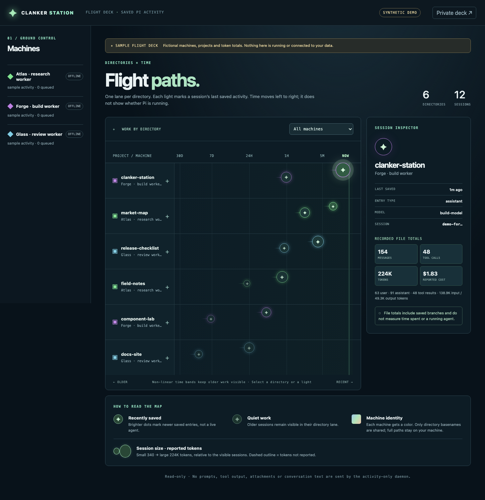

# Clanker Station

Clanker Station is a small dashboard for saved Pi activity. Flight Paths groups sessions by directory and positions them by **last saved activity**—not whether an agent is running.

Dot size represents reported session tokens. A dashed dot means token usage was not reported.

The app runs on https://applet.one. A local daemon reports the data.

Only session IDs, directory basenames and opaque keys, timestamps, entry kinds, models, and bounded message, tool, token and cost totals. **No prompts, conversation text, tool output, attachments or full paths are sent.**

## Synthetic showcase

Open `/demo` to explore three fictional machines:



## Deployment

Generate a setup key:
```sh
node -e 'const fs=require("node:fs");fs.writeFileSync("src/setup-key.js",`export const SETUP_KEY = "${require("node:crypto").randomBytes(32).toString("hex")}";\n`,{mode:0o600});fs.chmodSync("src/setup-key.js",0o600)'
```

```sh
pnpm install
applet login
applet deploy
```

Open the deployed URL and create the first owner account using the private key from `src/setup-key.js`. **Never commit the filled file**; the repository includes a blank template.

## Connect a machine

- In the dashboard, choose **Add machine**.
- From this project folder, run `node daemon/index.js setup`.
- Paste the token then enter or accept the URL and session root.
- Run `node daemon/index.js` to start watching.

## Development

- `pnpm test` — run daemon and UI tests.
- `applet build --dry-run` — validate the Worker.
- `pnpm dev` — start a local Worker.
- `applet deploy` — publish the app.