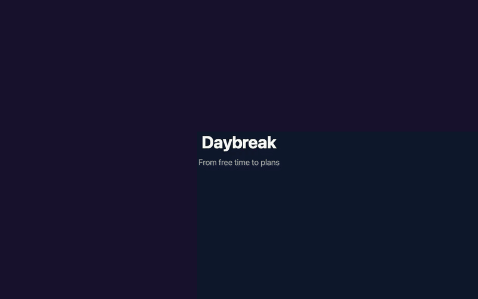

# Daybreak — make time for your people



Full-screen version: [GIF](docs/demo.gif) · [MP4 for websites](docs/demo.mp4). Original caption-banner version: [GIF](docs/demo-banner.gif) · [MP4](docs/demo-banner.mp4). [Reproduce the recordings](demo/README.md).

An Applet.one Worker app for finding time with friends. Users create accounts, send friend requests by registered email, add one-off availability, view friends’ full free schedules, and request meetings in shared free windows. Acceptance reserves the time for both people. Times use `Europe/Berlin` (CET/CEST).

## Run locally

```sh
pnpm install
pnpm dev
```

## Deploy

```sh
pnpm run deploy
```

This deploys the existing Daybreak Applet. It uses Applet’s installed builder and deployment API because the current `applet deploy` CLI tries to create an app on every deploy and fails when an account is already at its 10-app limit. On accounts below the limit, `applet deploy` also works. The live app is at https://cobaltsparkling-puma.applet.works.

## Manual password reset

There is intentionally **no public or self-service password reset** (the app sends no email). An operator with access to this project and the Applet deployment can reset an existing account:

```sh
pnpm run reset-password user@example.com
pnpm run deploy
```

Enter the new password in the interactive prompt. The command writes a salted password hash and unique one-time reset ID into `src/password-reset.js`; it does not store the plaintext password. **Do not commit that generated file.** Visit the deployed app once after deployment to apply the reset and invalidate all of that user’s sessions. Then restore `src/password-reset.js` to `export const passwordReset = null;` and deploy again. The reset ID prevents repeat application if the Worker runs again before it is removed. Back up state with `applet backup` if needed.

## Verify

```sh
node scripts/smoke.mjs
BASE_URL=https://cobaltsparkling-puma.applet.works node scripts/smoke.mjs
```

The smoke test creates two temporary accounts and checks friendship permissions, availability overlap, meeting acceptance and reservation, login and logout. Screenshots of the live browser verification are in `screenshots/`.
