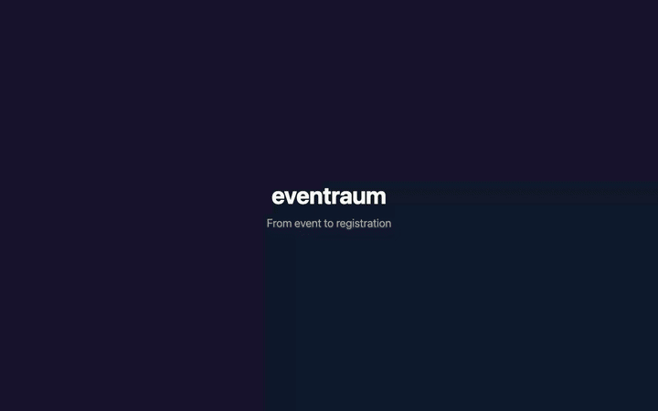

# eventraum — standalone event registration pilot

A React + Vite + Tailwind application with local shadcn-style components, served by an Applet Cloudflare Worker. Event and registration data live in a SQLite-backed Durable Object. No payment, email, CRM, accounting, or external asset service is connected.



## Screenshots

**Event discovery — desktop**


**Registration — mobile**


**Event management — desktop**


More views: [home on mobile](screenshots/live-home-mobile.png) · [registration on desktop](screenshots/live-booking-desktop.png) · [admin on mobile](screenshots/live-admin-mobile.png) · [privacy page on mobile](screenshots/live-privacy-mobile.png).

Worker configuration lives in `wrangler.jsonc`; Applet-only access/backup settings live in `applet.jsonc`. Use Applet CLI 0.2.5 or newer (runtime secrets support); see the shared [configuration guide](../README.md#configuration-and-cli).

## Run and test

```sh
pnpm install
(umask 077; printf 'EVENTRAUM_SETUP_KEY=%s\n' "$(openssl rand -hex 32)" > .dev.vars) # local-only runtime secret
pnpm dev                         # http://127.0.0.1:8787
pnpm test                        # unit tests
node scripts/smoke.mjs           # API smoke tests against local dev server
pnpm build                       # Vite build + Applet artifact validation
```

The UI build is embedded into `src/generated.js` (ignored by git), so `pnpm build:ui` is required before running Applet CLI directly. `pnpm run deploy` builds and deploys together.

## Admin setup and deployment

```sh
# First deployment: use the git-ignored .dev.vars generated above.
# The setup key stays in runtime secrets, never in the built code.
pnpm run build:ui
applet deploy --secrets-file .dev.vars

# Open /admin at the deployed URL.
# In the setup-key field, paste ONLY the value after EVENTRAUM_SETUP_KEY= in .dev.vars.
# Choose a password of at least 8 characters and keep it safe.
# If you see "Willkommen zurück.", an admin already exists: use its password.
# The setup key cannot reset an existing admin password.

# After successful setup, remove the hosted and local bootstrap secrets.
# No rebuild or redeploy needed.
applet secrets delete EVENTRAUM_SETUP_KEY
rm .dev.vars

# Later deployments (including existing apps with an admin):
# Password and saved state are preserved; no setup key needed.
pnpm run deploy

# Optional: download a state backup.
applet backup
```

Local `applet dev` reads `.dev.vars` automatically (Node.js 20.12+); deployment only reads it with `--secrets-file`. Legacy `.setup-key` files are no longer used and can be deleted.

Do not publish a usable signup flow for real users until the operator has supplied and reviewed full legal privacy information, retention/deletion policy, contact information, and payment/invoicing procedures. The public examples are fictional; the app is a pilot rather than a production-compliant ticket system.

## Current behavior

- Public event listing and responsive member/guest/multi-person signup, including companion pricing, early-bird pricing, code discounts, consent flags, and server-calculated totals.
- Paid registrations are **pending**, not confirmed and not charged. An admin must manually verify actual payment (and membership where relevant) before confirming. Free guest registrations confirm automatically; free member registrations require manual membership verification. No invoice is generated.
- Registration reference + one-time displayed access code (only its hash is stored) allow self-service lookup and cancellation. Keep both: **no emails are sent**. Confirmed registrations can cancel until 48 hours before the event. A refund, if needed, is only a manual follow-up.
- Protected admin dashboard for events, pricing, attendee lists, payment status, manual confirmation/cancellation, CSV export, and password rotation. Bookings and status changes are logged.
- Sample events are inserted only if the database has no events.

## Deferred before production

Online payment/refund providers, invoice numbering/PDF and delivery, email notifications, CRM/accounting export, membership verification, automatic data deletion, separate staff roles, per-ticket cancellation, manual participant insertion, and legal/DSGVO review. A manually recorded payment is **not** evidence of a provider transaction. Do not store payment card or bank details here.
