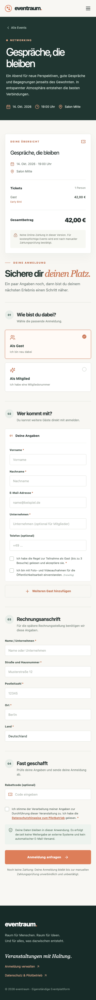
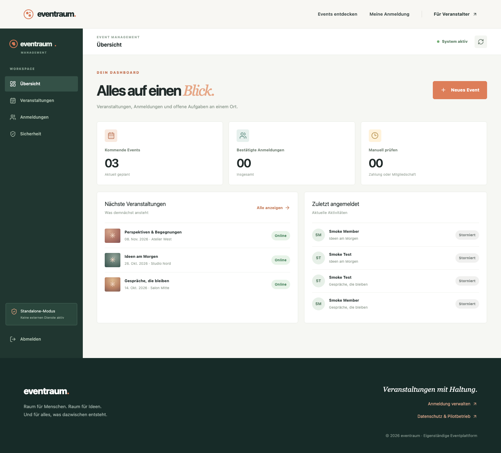

# eventraum — standalone event registration pilot

A React + Vite + Tailwind application with local shadcn-style components, served by an Applet Cloudflare Worker. Event and registration data live in a SQLite-backed Durable Object. No payment, email, CRM, accounting, or external asset service is connected.

## Screen recording


[Watch the MP4](docs/demo.mp4) · [Animated GIF](docs/demo.gif) · [Reproduce the recording](demo/README.md)

A ~68-second, five-scene desktop walkthrough with fading English explanations over the German UI: event discovery, member/companion early-bird prices, a discount and registration, self-service lookup, and the protected organizer dashboard. Captured locally with fictional data; the registration stays pending and no payment or email is sent. MP4: 1280×800 / 4.1 MiB. GIF: 720×450 / 9.6 MiB.

## Screenshots

**Event discovery — desktop**


**Registration — mobile**



**Event management — desktop**



More views: [home on mobile](screenshots/live-home-mobile.png) · [registration on desktop](screenshots/live-booking-desktop.png) · [admin on mobile](screenshots/live-admin-mobile.png) · [privacy page on mobile](screenshots/live-privacy-mobile.png).

## Run and test

```sh
pnpm install
openssl rand -hex 32 > .setup-key # one-time admin bootstrap secret; ignored by git
pnpm dev                         # http://127.0.0.1:8787
pnpm test                        # unit tests
node scripts/smoke.mjs           # API smoke tests against local dev server
pnpm build                       # Vite build + Applet artifact validation
```

The UI build is embedded into `src/generated.js` (ignored by git), so `pnpm build:ui` is required before running Applet CLI directly. `pnpm run deploy` builds and deploys together.

## Admin setup and deployment

1. Generate `.setup-key` before building. Deploy with `pnpm run deploy`.
2. Visit `/admin`, enter the private setup key and a unique password of at least 14 characters. Only the first setup request can create the account. The key is never returned in public API or UI assets.
3. Remove `.setup-key` and **redeploy** to remove the bootstrap secret from the Worker bundle. Keep the password securely and change it using **Sicherheit** in the dashboard.
4. Back up state using `applet backup`. Public access is configured in `applet.jsonc`.

Do not publish a usable signup flow for real users until the operator has supplied and reviewed full legal privacy information, retention/deletion policy, contact information, and payment/invoicing procedures. The public examples are fictional; the app is a pilot rather than a production-compliant ticket system.

## Current behavior

- Public event listing and responsive member/guest/multi-person signup, including companion pricing, early-bird pricing, code discounts, consent flags, and server-calculated totals.
- Paid registrations are **pending**, not confirmed and not charged. An admin must manually verify actual payment (and membership where relevant) before confirming. Free guest registrations confirm automatically; free member registrations require manual membership verification. No invoice is generated.
- Registration reference + one-time displayed access code (only its hash is stored) allow self-service lookup and cancellation. Keep both: **no emails are sent**. Confirmed registrations can cancel until 48 hours before the event. A refund, if needed, is only a manual follow-up.
- Protected admin dashboard for events, pricing, attendee lists, payment status, manual confirmation/cancellation, CSV export, and password rotation. Bookings and status changes are logged.
- Sample events are inserted only if the database has no events.

## Deferred before production

Online payment/refund providers, invoice numbering/PDF and delivery, email notifications, CRM/accounting export, membership verification, automatic data deletion, separate staff roles, per-ticket cancellation, manual participant insertion, and legal/DSGVO review. A manually recorded payment is **not** evidence of a provider transaction. Do not store payment card or bank details here.
