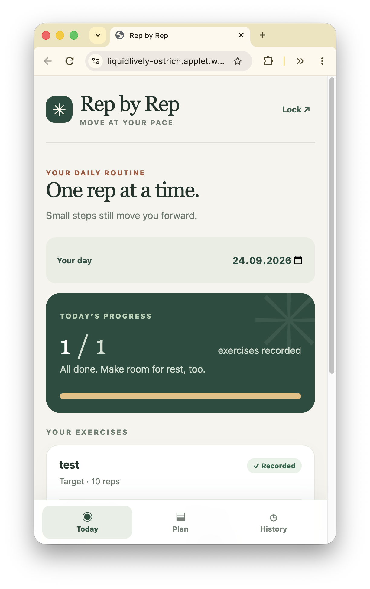

# Rep by Rep

A small, single-user physio applet for your mobile browser. Make a schedule, record reps or time, and track how each exercise felt. Three optional starter plans are ready to add and edit.



## Try it

Open the [Rep by Rep applet](https://liquidlively-ostrich.applet.works). On a fresh deployment, the first visitor sets a four-character passphrase. Four characters offer weak protection, so avoid sensitive health notes. Keep your passphrase safe—there is no recovery. The starter plans are examples, not medical advice; follow your clinician’s guidance.

## Develop locally

```sh
pnpm install
pnpm dev
```

## Publish with Applet

```sh
applet deploy
```

Applet publishes the app and its saved state under a shareable link. To download a copy of your applet’s state, run `applet backup` and keep the backup private.
