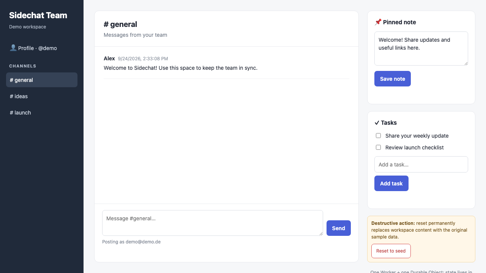

# sidechat



Sidechat is an Applet for team messages, notes, and tasks.

## Demo accounts

- User: `demo@demo.de` / `demo@demo.de`
- Admin: `admin@demo.de` / `admin@demo.de` (prompts to set a new password)

## Edit the app

Edit `src/page.html` for the HTML, CSS, and browser-side JavaScript. The server-side API and persistent state are in `src/index.js`. `src/page.js` is generated from the HTML file; do not edit it directly. `pnpm dev` and `pnpm deploy` regenerate it automatically. If you run `applet deploy` directly, run `pnpm build` first.

## Run locally

```sh
pnpm install
pnpm dev
```

## Deploy with Applet

```sh
pnpm deploy
```

## Delete the Applet deployment

```sh
applet delete
```

This permanently deletes the hosted deployment; it does not delete your local project.

## Back up application state

Backups are enabled for this starter. After deploying, run `applet backup` to download a JSON backup of its state.
